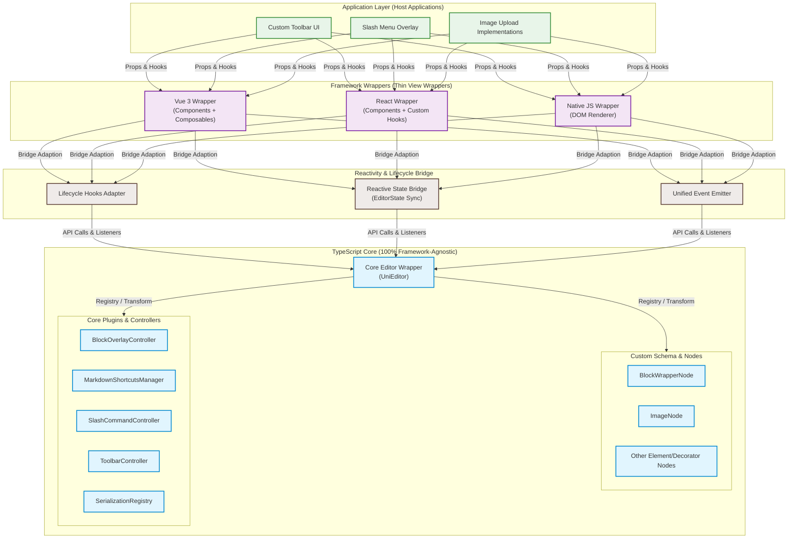
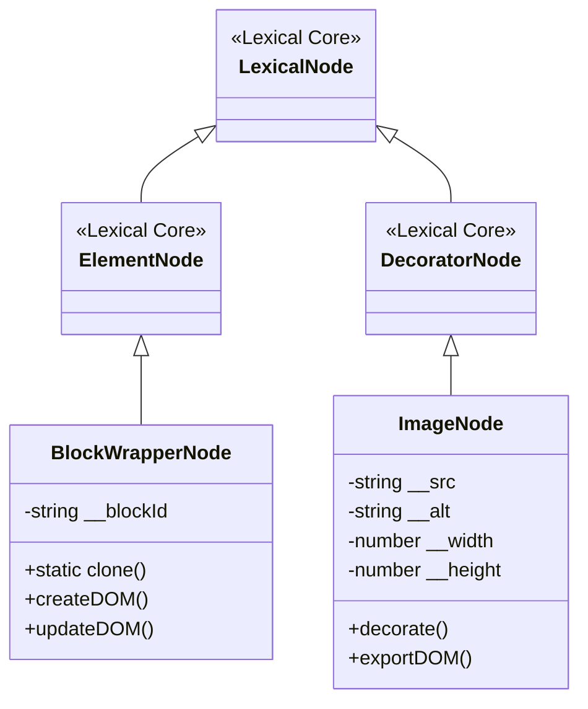
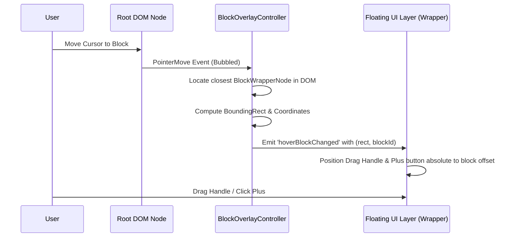
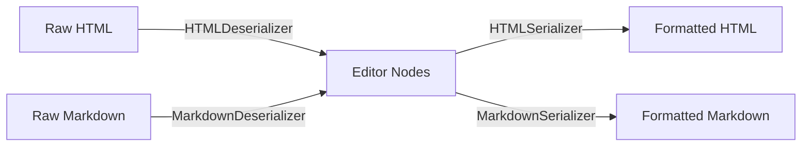

# UniLexical Architecture Specification
This document defines the architectural blueprints, technical boundaries, component relationships, and API specifications for **UniLexical**, an industrial-grade, framework-agnostic, block-based rich-text editor core powered by Meta's **Lexical** engine.

---

## 1. System Overview (系统总览)

UniLexical is architected on a **Three-Tier Decoupled Architecture**. The guiding principle is to separate the editor state, transformation logic, and command registration from the view layers of host frameworks (Vue 3, React, Vanilla JS).

### 1.1 Architecture Topology (架构拓扑图)



### 1.2 Layer Responsibilities (职责边界)

1. **TypeScript Core Layer (TS Core)**:
   - **Zero Framework Runtime Dependency**: Contains pure ES modules and Lexical-specific plugins.
   - **Lexical Instance Management**: Configures and instantiates the Lexical `Editor` instances.
   - **Custom Schema definitions**: Dictates node hierarchy, mutations, styles, and command registrations.
   - **State Mutation & Queries**: Only mutating state inside `$applyUpdate` block transitions and dispatching commands via Lexical API.
2. **Reactivity & Lifecycle Bridge**:
   - **Event Emitter**: Emits events (such as selection changes, slash-command trigger events, drag coordinates) to framework wrappers.
   - **State Sync**: Decouples Lexical’s immutable state engine from frameworks' reactive models, exposing standard sub/unsub patterns.
3. **Framework Wrappers (Thin Wrappers)**:
   - Responsible only for mounting DOM portals, handling component lifecycles (e.g., initialization on mount, cleanups on unmount), and binding framework-specific reactivity systems (such as React `useSyncExternalStore` or Vue `ref`/`shallowRef`).

---

## 2. Core Engine Design (核心引擎设计)

The core engine encapsulates Lexical to provide a clean, block-oriented programming interface.

### 2.1 Lexical Editor Encapsulation Strategy (`UniEditor`)

To maintain framework independence, the architecture defines a unified coordinator class, `UniEditor`. The core strategy focuses on:
- **Instance Isolation**: Instead of exposing raw Lexical configurations, `UniEditor` manages the instantiation of the editor instance internally. This isolates error boundaries and handles theme injection.
- **Lifecycle Coherence**: Orchestrates initialization, plugin mounting, and cleanup routines. When destroyed, it tears down all native event listeners and clears reference maps to prevent memory leaks in Single Page Applications (SPAs).
- **Transaction Safety**: Exposes transactional read and write methods, preventing direct mutations outside the scope of Lexical's internal scheduler.

### 2.2 Custom Node Design (自定义节点)

To achieve Notion's Block-based UX, Lexical's document structure must be augmented using custom nodes.



#### 2.2.1 `BlockWrapperNode` (Notion-style Blocks)
Lexical represents documents as a flat node tree rather than structured blocks. To align with a block-based UX:
- **Envelope Mapping**: Every top-level child under the editor root is wrapped in a `BlockWrapperNode`.
- **Identity Attribution**: Each wrapper assigns a unique block ID (`blockId`) to its DOM element (rendering as `.uni-block-wrapper` with a `data-block-id` attribute).
- **Layout Margins**: Houses the spacing offsets required to safely insert operations like drag-and-drop handles and insertion menus without colliding with the editable content.

#### 2.2.2 `ImageNode` (Advanced DecoratorNode)
Images are interactive leaf-block nodes that extend `DecoratorNode`. The node state manages attributes such as image source URI, alternative text descriptions, display dimensions, and load states. 

It implements DOM export methods designed to decouple media presentation from editing behaviors, preparing standard output markup.

### 2.3 Data Flow & Reactivity Bridge

```
[ User Interaction ] 
        │
        ▼ (DOM Event / Command Dispatch)
[ Command Registry ] ─────────► [ Node Transformations ]
        │                               │
        ▼                               ▼
[ Lexical EditorState Update (Immutable State Change) ]
        │
        ▼ (editor.registerUpdateListener)
[ Reactivity Bridge ]
   ├── Vue 3 Wrapper: Trigger ref / shallowRef updates
   ├── React Wrapper: React useSyncExternalStore tick
   └── Native JS Wrapper: Render Loop Hook
```

---

## 3. Module & Plugin Architecture (功能模块与插件设计)

### 3.1 Hover Toolbar & Drag Handle (行操作模块)

This plugin computes the boundaries of top-level `BlockWrapperNode`s in the DOM, rendering a floating action target.



#### Implementation details:
- **Event Delegation**: Register mouse pointer listeners on the top-level container element to avoid multiple event handlers.
- **Node Resolution**: Resolve the hovered element using coordinate detection or simple tree traversal up to a element with `[data-block-id]`.
- **Drag-and-Drop Implementation**:
  - The `BlockOverlayController` coordinates HTML5 drag-and-drop lifecycles (`dragstart`, `dragover`, `drop`).
  - During `dragstart`, the controller sets drag preview offsets and captures the target block key.
  - During `drop`, the editor triggers an atomic transaction: it resolves both the dragged block node and the drop target block node, evaluates the vertical overlap boundaries (to determine if the element is dropped before or after the target), and mutates the sibling relation using node relocation methods. This guarantees the operation is natively captured by Lexical's undo/redo history stack.

### 3.2 Real-time Markdown Shortcuts (实时快捷解析)

The shortcut parsing engine processes content mutations dynamically to apply formats as they are typed.

- **Transform Interception**: Registers a global transformer on text and element nodes. As characters are entered, the engine intercepts changes before they commit to the DOM.
- **Block Conversion (Syntax Checking)**: Scans block prefixes against registered regular expressions (e.g., matching a block starting with `# ` for H1, `## ` for H2, or `> ` for blockquotes). Upon matching, the transformer instantiates the target block node, detaches all children from the current paragraph node, appends them to the new node, replaces the old block in-place, and migrates selection focus.
- **Inline Format Parsing**: Detects inline boundary markup (such as double asterisks for bold or backticks for code). Upon typing a matching closing delimiter, the regex evaluator slices the string, extracts the text contents, cleans the markdown syntax tokens, and creates a text node formatted with the targeted font style flag.

### 3.3 Slash Command Popup (斜杠菜单)

A stateful context trigger that manages trigger keys, filtering queries, and caret position.

1. **Trigger Phase**: The controller intercepts keyboard updates using the update listener.
2. **Context Analysis**: It verifies if the cursor is at the end of a block and checks if the text sequence ends with a standalone `/` token preceded by a space or line boundary.
3. **Caret Position Tracking**: The controller queries the window selection bounds to compute the exact absolute pixel coordinates (`DOMRect`) of the caret. It then fires a trigger event containing visibility state, cursor bounds, and query text.
4. **Keyboard Event Hijacking**: When active, the controller overrides keydown events. It intercepts keys such as `ArrowUp`, `ArrowDown`, and `Enter` to control navigation and confirmation in the popup UI rather than shifting cursor positions in the text. Once a command is chosen or cancelled, the listener releases control back to the text entry buffer.

### 3.4 Customizable Toolbar (可定制工具栏)

The Toolbar controller acts as a pure read-state emitter. It aggregates active states from the current selection.

- **Selection Queries**: Subscribes to document updates. On selection changes, it checks formatting states (such as bold, italic, underline, strike-through) and determines the tag types of parent nodes.
- **State Emitting**: Compiles active parameters into a flat state object. It notifies framework adapters of change events so they can toggle visual button states.
- **Command Control mapping**: Avoids direct state setting from UI buttons. Instead, toolbar UI wrappers invoke core command dispatches, executing targeted format dispatches when buttons are clicked.

### 3.5 Data Serialization & Deserialization (多格式导入导出)

This module handles Markdown and HTML import/export strategies. It acts as an adapter Registry.



- **Clean HTML Serialization**: During output, blockwrapper structural elements are stripped. Node export interfaces convert the clean semantic payload (e.g., standard paragraphs, blockquotes, tables) into clean HTML tags.
- **Markdown AST Mapping**: The module parses imported Markdown nodes directly into Lexical nodes, and exports matching Markdown strings via pre-configured block and inline transformers.

### 3.6 Advanced Image Handling (图片处理)

The image subsystem balances synchronous interface response with asynchronous media upload requirements.

- **Placeholder Lifecycle**: Insertion instantly creates an `ImageNode` containing a temporary preview URI (such as a local Blob URL) and flags the node with a loading status.
- **Upload Dependency Injection**: The editor initialization accepts an external asynchronous upload handler. 
  - If provided, the core invokes the upload handler with the raw file data. Once resolved, the core starts a write transaction, replaces the image URI with the remote URL, and toggles the loading flag to false.
  - If the upload handler is not provided, the core falls back to a base64 serializer. The file reader encodes the asset data into a Data URL, writing the base64 string directly to the node's image source attribute.

---

## 4. Cross-Framework Wrapper Strategy (跨框架封装策略)

The core principle of UniLexical's cross-framework wrapper system is that **no business logic is written in React, Vue, or Vanilla bindings**. They are thin adapters serving as lifecycle and reactivity bridges.

### 4.1 React Wrapper Bridge (`useLexical`)

- **State Sync**: React wrappers connect to `UniEditor` using the `useSyncExternalStore` Hook (React 18+). It translates Lexical's internal update notifications into React store ticks, triggering local updates only when selected data changes.
- **Lifecycle Mapping**: Mounts and binds DOM roots during React's layout phase, and executes complete editor instance teardown on cleanup.

### 4.2 Vue 3 Wrapper Bridge (`useLexical`)

- **Preventing Deep Reactivity Proxy**: Vue 3's core reactive wrappers use deep proxy models to intercept property mutations. However, Lexical relies on raw object references and immutable update structures. Wrapping the core editor or nodes in reactive proxies breaks this system, creating performance drops and update loops.
- **Shallow Reference Strategy**: Vue wrappers isolate the editor instance inside a `shallowRef`, ensuring that the reactive system only tracks references to the editor wrapper rather than its internal structures.
- **Update Integration**: Captures updates from the core update cycle and maps them to light Vue reactive values, emitting data changes through standard Vue event emitters.

---

## 5. Data Schema & API Design (数据结构与接口设计)

### 5.1 Editor Initialization Config Schema

The initialization settings specify the options used when creating a `UniEditor` instance.

| Config Key | Description | Type Specification |
| :--- | :--- | :--- |
| `theme` | Optional class mappings used to style DOM elements generated by the editor. | Object mapping Lexical theme keys to classes |
| `nodes` | Register schema classes for custom nodes enabled in the editor instance. | Array of custom node classes (e.g. `BlockWrapperNode`) |
| `imageOptions` | Configuration containing upload helper adapters. | Object with an optional async upload handler function |
| `initialContent` | Initial content payload to populate the document on initialization. | String containing formatted content |
| `initialFormat` | The format of the `initialContent` payload. | Enum: `'html'` or `'markdown'` or `'json'` |

### 5.2 Serialization Protocol

The serialization registry defines how the editor transfers document data between external formats and internal nodes.

#### Serializer Registry Interface
- **registerSerializer**: Registers a serializer mapping instance for a content target format.
- **serialize**: Returns a string representation of the current document structure in the requested format (`'html'`, `'markdown'`, or `'json'`).
- **deserialize**: Parses input content strings, clears current document contents, and populates the editor with matching internal nodes.

#### Format Adapter Interface
- **exportToString**: Converts the internal editor node state to a formatted string.
- **importFromString**: Parses an input string and generates corresponding internal nodes.

### 5.3 Unified Events Map

The core framework exposes a unified event emitter that wrappers can subscribe to.

| Event Name | Trigger Condition | Payload Properties |
| :--- | :--- | :--- |
| `change` | Fired when any modification updates the editor document state. | The new immutable editor state instance |
| `toolbarChange` | Fired when selection states update, signaling formatting changes to the UI. | Object containing boolean state flags for active text formats |
| `slashTriggered` | Fired when the slash command trigger condition is met or dismissed. | Visibility flag, query text, and carets coordinates (`DOMRect`) |
| `blockHoverChanged` | Fired when pointer moves over different blocks, positioning UI overlays. | Active block ID and its target element coordinates (`DOMRect`) |
| `error` | Fired when internal editor errors occur during transactions or rendering. | Error instance |
| `destroy` | Fired during editor destruction to let wrappers clean up listener bindings. | Void |
